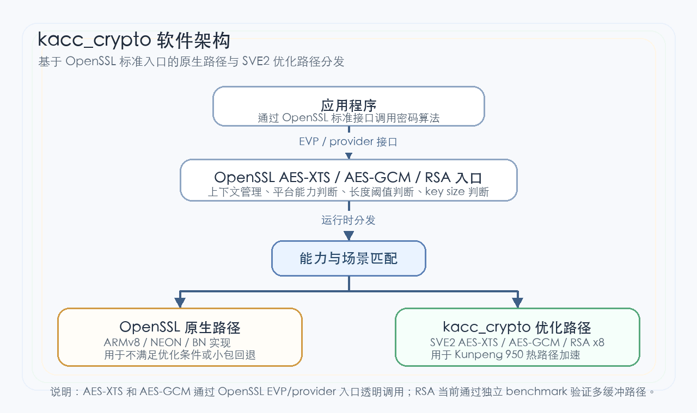

# KACC_Crypto鲲鹏密码算法优化介绍

简体中文|[English]

## 最新消息

- [2026.09.30]：发布KACC_Crypto 1.0，新增AES-XTS SVE2优化、AES-GCM SVE2优化和RSA multi-buffer优化。

## 项目介绍

### KACC_Crypto介绍

`KACC_Crypto`是面向鲲鹏950处理器AArch64平台的OpenSSL密码算法优化源码仓库，当前包含AES-XTS、AES-GCM和RSA三类优化代码、源码接入脚本以及功能/性能验证脚本。

本仓库当前不提供独立运行时库。AES-XTS和AES-GCM优化通过源码接入方式集成到目标OpenSSL源码树。重新编译OpenSSL后，业务应用仍通过OpenSSL EVP/provider接口调用对应算法。RSA优化当前通过独立benchmark可执行文件验证8路多缓冲private CRT路径。

`KACC_Crypto`适用于OpenSSL密码算法优化验证、SVE2指令路径评估、上游化补丁开发和性能基线对比等场景。

### 软件架构

`KACC_Crypto`以OpenSSL源码树为集成目标，通过接入脚本把优化源码、构建规则和分发逻辑写入OpenSSL对应模块。整体架构如[**图 1** 软件架构](#软件架构)所示。

**图 1** 软件架构<a id="软件架构"></a>



软件架构中各模块功能如[**表 1** 模块功能描述](#模块功能描述)所示。

**表 1** 模块功能描述<a id="模块功能描述"></a>

| 模块名称 | 功能描述 |
| --- | --- |
| 应用程序 | 使用OpenSSL标准接口调用AES-XTS、AES-GCM或RSA能力。 |
| OpenSSL EVP/provider | 提供算法入口、上下文管理和硬件能力分发。 |
| OpenSSL开源路径 | 保留OpenSSL已有ARMv8/NEON/BN实现，作为不满足优化条件时的回退路径。 |
| AES-XTS SVE2优化 | 新增AArch64 SVE2 AES-XTS stream实现，支持AES-128/192/256 XTS加解密。 |
| AES-GCM SVE2优化 | 新增SVE2 AES-CTR与GHASH大窗口融合路径，支持AES-128/192/256 GCM加解密。 |
| RSA SVE2 x8优化 | 新增8路多缓冲Montgomery计算内核，通过benchmark验证RSA2048/RSA4096 private CRT性能。 |
| 接入脚本 | 把优化源码复制到目标OpenSSL源码树，并修改构建规则和分发锚点。 |
| 测试脚本 | 提供正确性验证、性能矩阵测试和benchmark可执行文件生成入口。 |

### 算法支持与规格

当前支持的算法和调用方式如[**表 2** 算法支持与规格](#算法支持与规格表)所示。

**表 2** 算法支持与规格<a id="算法支持与规格表"></a>

| 算法 | 支持规格 | 优化方式 | 调用方式 | 说明 |
| --- | --- | --- | --- | --- |
| AES-XTS | AES-128-XTS、AES-192-XTS、AES-256-XTS加密和解密 | SVE2 AES指令实现XTS stream热路径 | OpenSSL EVP/provider AES-XTS | 不满足能力条件或不适合SVE2的输入继续使用OpenSSL开源路径。 |
| AES-GCM | AES-128-GCM、AES-192-GCM、AES-256-GCM加密和解密 | SVE2 AES-CTR与GHASH大窗口融合 | OpenSSL EVP/provider AES-GCM | 默认8192B及以上进入SVE2路径，小包和尾部保留ARMv8/NEON路径。 |
| RSA | RSA2048、RSA4096 private CRT benchmark | SVE2 x8 Montgomery多缓冲计算 | 独立benchmark可执行文件 | 当前不是OpenSSL对外RSA API的透明分发。 |

> **说明：**
>
>- AES-XTS当前热路径按SVE vector length为256bit的机器调优，其他VL需要单独验证。
>- AES-GCM需要目标机器支持ARMv8 AES、PMULL和SVE2。
>- RSA benchmark输出`correctness=PASS`表示功能校验通过。

## 目录结构

项目目录层级介绍如下。

```text
├── docs                                      # 项目文档目录
│   ├── LICENSE                               # 文档许可证
│   └── zh                                    # 中文文档目录
│       ├── figures                           # 文档图片资源
│       ├── installation_guide.md             # 安装指南
│       ├── menu_kacc_crypto.md               # 文档菜单
│       ├── quick_start.md                    # 快速入门
│       ├── release_notes.md                  # 版本说明书
│       ├── user_guide.md                     # 用户指南
│       └── public_sys-resources              # 文档图标资源
├── openssl
│   ├── crypto
│   │   ├── aes/asm                           # AES-XTS SVE2 源码和测试
│   │   ├── bn/asm                            # RSA SVE2 x8 汇编内核
│   │   └── modes                             # AES-GCM SVE2 源码和测试
│   └── test                                  # RSA benchmark 源码
├── scripts                                   # OpenSSL 源码接入和测试脚本
└── README.md                                 # 项目说明文档
```

## 版本说明

当前版本信息如[**表 3** 版本信息](#版本信息)所示。

**表 3** 版本信息<a id="版本信息"></a>

| 项目 | 说明 |
| --- | --- |
| 产品名称 | KACC_Crypto |
| 分支 | dev |
| 软件形态 | OpenSSL密码算法优化源码、接入脚本和测试脚本 |
| 覆盖算法 | AES-XTS、AES-GCM、RSA |
| 目标平台 | 鲲鹏950处理器AArch64 Linux |
| OpenSSL版本 | 建议OpenSSL 3.0系列或与接入脚本锚点匹配的源码树 |

详细版本能力、注意事项和遗留问题请参见《[版本说明书](./docs/zh/release_notes.md)》。

## 软件包完整性校验

为确保软件包在下载、传输、存储及交付过程中的完整性，请从可信渠道获取软件包及对应校验文件，并按以下说明进行校验。

请根据实际发布的校验文件选择对应方式：

- 数字签名校验：验证软件包来源真实性及完整性。
- SHA-256校验：验证软件包完整性，不单独证明来源真实性。

> **说明：**
>
>以下文件名和命令为校验示例，不表示当前版本已提供对应发布附件。使用时请以官方发布的软件包名称、校验文件和签名方式为准。

### 1. 校验文件

| 文件名称（示例） | 说明 |
| --- | --- |
| `kacc_crypto-1.0.zip` | 待校验的软件包。 |
| `kacc_crypto-1.0.zip.asc` | 软件包对应的OpenPGP分离式签名文件，仅适用于发布方提供此类签名的情况。 |
| `kacc_crypto-1.0.zip.sha256` | 软件包对应的SHA-256校验文件，内容应包含摘要值及对应软件包文件名。 |

> **须知：**
>
>校验文件仅应从官方发布渠道获取。校验前，请将软件包及对应校验文件放在同一目录，并进入该目录执行命令。

### 2. 校验步骤

根据实际发布的校验方式执行对应操作。

**方式一：数字签名校验**

若发布方提供OpenPGP分离式签名，先从可信发布渠道获取签名公钥，按发布方公布的可信指纹核对公钥并导入GPG，再执行：

```shell
gpg --verify kacc_crypto-1.0.zip.asc kacc_crypto-1.0.zip
```

如发布方使用其他签名格式，请按对应发布说明执行验证。

验证时应确认：

- 签名文件与待校验软件包匹配；
- 使用的公钥或证书来自可信发布渠道，签名者身份与发布方一致；
- 签名验证结果为成功，命令退出状态为0；
- 软件包未被修改或替换。

**方式二：SHA-256校验**

在Linux环境下执行：

```shell
sha256sum --check kacc_crypto-1.0.zip.sha256
```

输出对应软件包的`OK`（或本地化成功提示）且命令退出状态为0，表示摘要值一致。校验时应确认：

- SHA-256校验文件与待校验软件包匹配；
- 计算得到的摘要值与校验文件中的摘要值一致；
- 校验文件来自可信发布渠道。

### 3. 结果判定

| 校验结果 | 判定及处理 |
| --- | --- |
| 签名验证通过且签名者身份可信，或可信渠道获取的SHA-256摘要值一致 | 对应校验通过，可继续使用；SHA-256校验不单独证明来源真实性。 |
| 签名验证失败或SHA-256摘要值不一致 | 软件包可能发生异常变更，不应继续使用。 |
| 校验文件缺失 | 无法完成校验，应从可信渠道重新获取相关文件。 |
| 软件包与校验文件不匹配 | 应确认软件包版本、文件名称及校验文件是否对应。 |

### 4. 异常处理

校验失败时，请重新下载软件包，重新获取对应校验文件，并确认软件包与校验文件是否匹配且来自可信渠道。如问题仍未解决，请联系软件包发布方。

## 环境部署

### 环境要求

部署前请确保环境满足[**表 4** 环境要求](#环境要求表)。

**表 4** 环境要求<a id="环境要求表"></a>

| 环境 | 要求 |
| --- | --- |
| 服务器和处理器 | 鲲鹏950处理器 |
| 架构 | AArch64 |
| 操作系统 | AArch64 Linux |
| 指令能力 | ARMv8 AES、PMULL、SVE2 |
| 编译器 | 支持AArch64 SVE2相关`-march`选项的GCC或Clang |
| 构建工具 | `git`、`gcc`或`clang`、`make`、`perl` |

### 安装基础软件

以 yum系发行版为例。

```shell
sudo yum install -y git gcc make perl
```

以 apt系发行版为例。

```shell
sudo apt-get update
sudo apt-get install -y git gcc make perl
```

### 准备OpenSSL

```shell
git clone https://github.com/openssl/openssl.git -b openssl-3.0
cd openssl
./Configure linux-aarch64
make -j$(nproc)
```

更详细的环境部署、源码接入和安装后检查步骤请参见《[安装指南](./docs/zh/installation_guide.md)》。

## 快速入门

1. 获取`KACC_Crypto`源码。

    ```shell
    git clone https://gitcode.com/weiaq/kacc_crypto.git -b dev
    cd kacc_crypto
    export OPENSSL_DIR=/path/to/openssl
    ```

2. 接入AES-XTS优化。

    ```shell
    ./scripts/install_sve2_xts_dispatch.sh "${OPENSSL_DIR}"
    cd "${OPENSSL_DIR}"
    make -j$(nproc)
    ```

3. 接入AES-GCM优化。

    ```shell
    cd /path/to/kacc_crypto
    ./scripts/install_sve2_gcm_dispatch.sh "${OPENSSL_DIR}"
    cd "${OPENSSL_DIR}"
    make -j$(nproc)
    ```

4. 生成RSA benchmark可执行文件。

    ```shell
    cd /path/to/kacc_crypto
    OPENSSL_DIR=/path/to/openssl ./scripts/apply_and_test_rsa.sh
    ```

5. 执行基础验证。

    ```shell
    cd /path/to/kacc_crypto
    OPENSSL_DIR=/path/to/openssl ./scripts/apply_and_test_xts.sh
    OPENSSL_DIR=/path/to/openssl ./scripts/apply_and_test_gcm.sh

    cd /path/to/openssl
    taskset -c 10 test/rsa2048_private_rsaz29_x8_bench 1000 all
    taskset -c 10 test/rsa4096_private_rsaz29_x8_bench 200 all
    ```

详细的源码获取、OpenSSL构建、优化代码接入和基础验证操作，请参见[快速入门](./docs/zh/quick_start.md)。

## 使用说明

### AES-XTS优化

AES-XTS优化接入OpenSSL provider AES-XTS分发层。重新编译OpenSSL后，应用无需调用新的外部接口，仍通过OpenSSL EVP/provider使用AES-XTS。

可使用OpenSSL speed验证EVP路径。

```shell
cd /path/to/openssl
./apps/openssl speed -elapsed -seconds 10 -evp aes-128-xts aes-192-xts aes-256-xts
```

### AES-GCM优化

AES-GCM优化接入OpenSSL provider AES-GCM大块update路径。默认8192B及以上进入SVE2路径，小包、尾部和不满足能力条件的场景继续使用ARMv8/NEON路径。

可使用OpenSSL speed验证EVP路径。

```shell
cd /path/to/openssl
./apps/openssl speed -elapsed -seconds 10 -evp aes-128-gcm aes-192-gcm aes-256-gcm
```

### RSA

RSA当前通过独立benchmark验证8路多缓冲private CRT路径。默认脚本只生成RSA2048和RSA4096 benchmark可执行文件，不自动执行长时间性能测试。

```shell
cd /path/to/openssl
taskset -c 10 test/rsa2048_private_rsaz29_x8_bench 1000 all
taskset -c 10 test/rsa4096_private_rsaz29_x8_bench 200 all
```

输出中包含`correctness=PASS`表示功能校验通过。性能结果重点关注`blinded_speedup_vs_native_default`；分析纯数学内核时可参考`math_speedup_vs_native_no_blind`。

## 学习文档

| 学习文档名称 | 学习资源简介 |
| --- | --- |
| [快速入门](./docs/zh/quick_start.md) | 快速完成源码获取、OpenSSL构建、优化代码接入和基础验证。 |
| [安装指南](./docs/zh/installation_guide.md) | 描述环境要求、三算法接入步骤、编译步骤和测试步骤。 |
| [用户指南](./docs/zh/user_guide.md) | 描述AES-XTS、AES-GCM和RSA优化的使用入口、参数和验证方法。 |
| [版本说明书](./docs/zh/release_notes.md) | 描述版本配套、能力范围、注意事项和遗留问题。 |
| [文档许可证](./docs/LICENSE) | 说明文档许可证。 |

## License

文档许可证详见 [docs/LICENSE](./docs/LICENSE)。源码许可证如需单独声明，请以后续新增的仓库根目录许可证文件为准。

## 贡献声明

欢迎大家为社区做贡献，如果使用过程中有任何问题/建议，或者需要反馈特性需求和bug报告，可以提交[Issues](https://gitcode.com/boostkit/community/blob/master/docs/contributor/issue-submit.md)联系我们，具体贡献方法可参考[贡献指南](https://gitcode.com/boostkit/community/blob/master/docs/contributor/contributing.md)。同时也欢迎大家在[讨论专区](https://gitcode.com/boostkit/community/discussions)展开讨论交流。感谢您的支持。

## 致谢

感谢来自社区的每一个PR，欢迎贡献鲲鹏KACC_Crypto！
