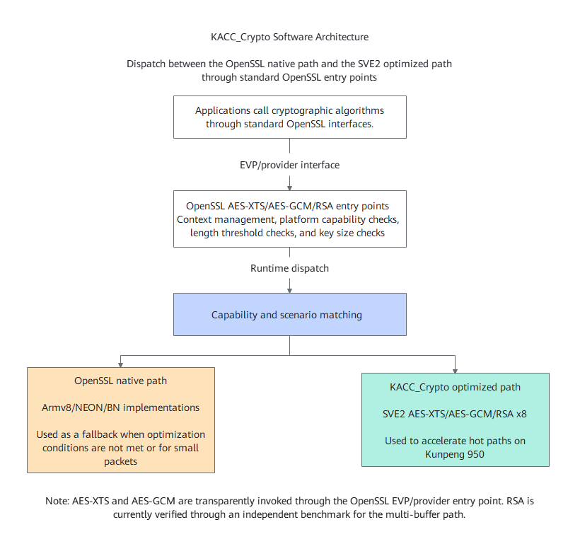

# KACC_Crypto Cryptographic Algorithm Optimization

English|[简体中文](./README.md)

## What's New

- [2026-09-30]: Released KACC_Crypto V1.1.0, which incorporated AES-XTS SVE2 optimization, AES-GCM SVE2 optimization, and RSA multi-buffer optimization.

## Project Introduction

### KACC_Crypto

`KACC_Crypto` is an OpenSSL cryptographic algorithm optimization source repository for the Kunpeng 950 processor on the AArch64 platform. It currently contains three categories of optimized code (AES-XTS, AES-GCM, and RSA), source code integration scripts, and functional/performance verification scripts.

This repository does not currently provide a standalone runtime library. The AES-XTS and AES-GCM optimizations are integrated into the target OpenSSL source tree through source code integration. After OpenSSL is recompiled, applications still invoke the corresponding algorithms through the OpenSSL EVP/provider interface. The RSA optimization is currently verified through a standalone benchmark executable for the 8-way multi-buffer private CRT path.

`KACC_Crypto` is suitable for scenarios such as OpenSSL cryptographic algorithm optimization verification, SVE2 instruction path evaluation, upstream patch development, and performance baseline comparison.

### Software Architecture

`KACC_Crypto` integrates with the OpenSSL source tree by writing the optimized source code, build rules, and distribution logic into the corresponding OpenSSL modules through integration scripts. [**Figure 1** Software architecture](./docs/en/figures/software-architecture.png) shows the overall architecture.

**Figure 1** Software architecture<a id="software-architecture"></a>



[**Table 1** Module functions](#module-function-description) describes the functions of each module in the software architecture.

**Table 1** Module functions<a id="module-function-description"></a>

| Module | Function Description |
| --- | --- |
| Application | Invokes AES-XTS, AES-GCM, or RSA capabilities through standard OpenSSL interfaces. |
| OpenSSL EVP/provider | Provides algorithm entry points, context management, and hardware capability dispatch. |
| OpenSSL open-source path | Retains the existing Armv8/NEON/BN implementations in OpenSSL as the fallback path when optimization conditions are not met. |
| AES-XTS SVE2 optimization | Adds an AArch64 SVE2 AES-XTS stream implementation, supporting AES-128/192/256 XTS encryption and decryption. |
| AES-GCM SVE2 optimization | Adds an SVE2 AES-CTR and GHASH large-window fused path, supporting AES-128/192/256 GCM encryption and decryption. |
| RSA SVE2 x8 optimization | Adds an 8-way multi-buffer Montgomery computation kernel, verified through benchmark for RSA2048/RSA4096 private CRT performance. |
| Integration script | Copies the optimized source code to the target OpenSSL source tree and modifies the build rules and distribution anchors. |
| Test script | Provides entry points for correctness verification, performance matrix testing, and benchmark executable generation. |

### Algorithm Support and Specifications

[**Table 2** Algorithm support and specifications](#algorithm-support-and-specifications-table) describes the currently supported algorithms and invocation methods.

**Table 2** Algorithm support and specifications<a id="algorithm-support-and-specifications-table"></a>

| Algorithm | Supported Specifications | Optimization Method | Invocation Method | Description |
| --- | --- | --- | --- | --- |
| AES-XTS | AES-128-XTS, AES-192-XTS, and AES-256-XTS encryption and decryption | XTS stream hot path implemented using SVE2 AES instructions | OpenSSL EVP/provider AES-XTS | Inputs that do not meet the capability conditions or are not suitable for SVE2 continue to use the OpenSSL open-source path. |
| AES-GCM | AES-128-GCM, AES-192-GCM, and AES-256-GCM encryption and decryption | SVE2 AES-CTR and GHASH fusion with large window | OpenSSL EVP/provider AES-GCM | By default, the SVE2 path is used for input lengths of 8,192 bytes and more, while the Armv8/NEON path continues to be used for small packets and tail data. |
| RSA | RSA2048 and RSA4096 private CRT benchmark | SVE2 x8 Montgomery multi-buffer computation | Standalone benchmark executable | Currently, it is not a transparent dispatch through OpenSSL's public RSA API. |

> **Note:**
>
>- The AES-XTS hot path is currently tuned for machines with an SVE vector length of 256 bits. Machines with other vector lengths require separate verification.
>- AES-GCM requires the target machine to support Armv8 AES, PMULL, and SVE2.
>- The RSA benchmark output `correctness=PASS` indicates that functional verification has passed.

## Directory Structure

The project directory hierarchy is described as follows:

```text
├── docs                                      # Project documentation directory
│   ├── LICENSE                               # Document license
│   ├── zh                                    # Chinese documentation directory
│       ├── figures                           # Image resources
│       ├── installation_guide.md             # Installation Guide
│       ├── menu_kacc_crypto.md               # Documentation menu
│       ├── quick_start.md                    # Quick Start
│       ├── release_notes.md                  # Release Notes
│       ├── user_guide.md                     # User Guide
│       └── public_sys-resources              # Icon resources
│   └── en                                    # English documentation directory
│       ├── figures                           # Image resources
│       ├── installation_guide.md             # Installation Guide
│       ├── menu_kacc_crypto.md               # Documentation menu
│       ├── quick_start.md                    # Quick Start
│       ├── release_notes.md                  # Release Notes
│       ├── user_guide.md                     # User Guide
│       └── public_sys-resources              # Icon resources
├── openssl
│   ├── crypto
│   │   ├── aes/asm                           # AES-XTS SVE2 source code and tests
│   │   ├── bn/asm                            # RSA SVE2 x8 assembly kernel
│   │   └── modes                             # AES-GCM SVE2 source code and tests
│   └── test                                  # RSA benchmark source code
├── scripts                                   # OpenSSL source code integration and test scripts
└── README.md                                 # Project description document
```

## Release Notes

[**Table 3** Version Information](#version-information) describes the current version information.

**Table 3** Version information<a id="version-information"></a>

| Item | Description |
| --- | --- |
| Product name | Kunpeng BoostKit |
| Product version | 26.2.RC1 |
| Software name | KACC_Crypto |
| Software version | V1.1.0 |

For detailed version capabilities, precautions, and known issues, see [Release Notes](./docs/en/release_notes.md).

## Environment Setup

### Environment Requirements

Before deployment, verify the environment based on [**Table 4** Environment requirements](#environment-requirements).

**Table 4** Environment requirements<a id="environment-requirements"></a>

| Environment | Requirement |
| --- | --- |
| Server and processor | Kunpeng 950 processor |
| Architecture | AArch64 |
| OS | AArch64 Linux |
| Instruction capabilities | Armv8 AES, PMULL, and SVE2 |
| Compiler | GCC or Clang that supports AArch64 SVE2-related -march options |
| Build tool | git, gcc or clang, make, perl |
| OpenSSL version | Recommended: OpenSSL 3.0 series or a source tree matching the integration script anchors |

### Installing Basic Software

- Take a yum-based distribution as an example.

```shell
sudo yum install -y git gcc make perl
```

- Take an apt-based distribution as an example.

```shell
sudo apt-get update
sudo apt-get install -y git gcc make perl
```

### Preparing OpenSSL

```shell
git clone https://github.com/openssl/openssl.git -b openssl-3.0
cd openssl
./Configure linux-aarch64
make -j$(nproc)
```

For environment setup details, source code integration, and post-installation verification, see [Installation Guide](./docs/en/installation_guide.md).

## Quick Start

1. Obtain the `KACC_Crypto` source code.

    ```shell
    git clone https://gitcode.com/weiaq/kacc_crypto.git -b dev
    cd kacc_crypto
    export OPENSSL_DIR=/path/to/openssl
    ```

2. Integrate the AES-XTS optimization.

    ```shell
    ./scripts/install_sve2_xts_dispatch.sh "${OPENSSL_DIR}"
    cd "${OPENSSL_DIR}"
    make -j$(nproc)
    ```

3. Integrate the AES-GCM optimization.

    ```shell
    cd /path/to/kacc_crypto
    ./scripts/install_sve2_gcm_dispatch.sh "${OPENSSL_DIR}"
    cd "${OPENSSL_DIR}"
    make -j$(nproc)
    ```

4. Generate the RSA benchmark executable.

    ```shell
    cd /path/to/kacc_crypto
    OPENSSL_DIR=/path/to/openssl ./scripts/apply_and_test_rsa.sh
    ```

5. Perform basic verification.

    ```shell
    cd /path/to/kacc_crypto
    OPENSSL_DIR=/path/to/openssl ./scripts/apply_and_test_xts.sh
    OPENSSL_DIR=/path/to/openssl ./scripts/apply_and_test_gcm.sh

    cd /path/to/openssl
    taskset -c 10 test/rsa2048_private_rsaz29_x8_bench 1000 all
    taskset -c 10 test/rsa4096_private_rsaz29_x8_bench 200 all
    ```

For details about source code acquisition, OpenSSL build, optimized code integration, and basic verification operations, see [Quick Start](./docs/en/quick_start.md).

## Usage Description

### AES-XTS Optimization

The AES-XTS optimization is integrated into the OpenSSL provider AES-XTS dispatch layer. After OpenSSL is recompiled, applications do not need to call new external interfaces and can still use AES-XTS through OpenSSL EVP/provider.

You can use OpenSSL speed to verify the EVP path.

```shell
cd /path/to/openssl
./apps/openssl speed -elapsed -seconds 10 -evp aes-128-xts aes-192-xts aes-256-xts
```

### AES-GCM Optimization

The AES-GCM optimization is integrated into the OpenSSL provider AES-GCM large-block update path. By default, blocks of 8,192 bytes or larger enter the SVE2 path, while small packets, tail data, and scenarios that do not meet the capability conditions continue to use the Armv8/NEON path.

You can use OpenSSL speed to verify the EVP path.

```shell
cd /path/to/openssl
./apps/openssl speed -elapsed -seconds 10 -evp aes-128-gcm aes-192-gcm aes-256-gcm
```

### RSA

RSA currently verifies the 8-way multi-buffer private CRT path through an independent benchmark. The default script only generates RSA2048 and RSA4096 benchmark executables, and does not automatically run long-duration performance tests.

```shell
cd /path/to/openssl
taskset -c 10 test/rsa2048_private_rsaz29_x8_bench 1000 all
taskset -c 10 test/rsa4096_private_rsaz29_x8_bench 200 all
```

An output containing `correctness=PASS` indicates that the functional verification has passed. For performance results, focus on `blinded_speedup_vs_native_default`; when analyzing the pure mathematical kernel, refer to `math_speedup_vs_native_no_blind`.

## Related Documents

| Document Name | Description |
| --- | --- |
| [Quick Start](./docs/en/quick_start.md) | Describes how to quickly complete source code acquisition, OpenSSL build, optimized code integration, and basic verification. |
| [Installation Guide](./docs/en/installation_guide.md) | Describes environment requirements, integration steps for the three algorithms, compilation steps, and test steps. |
| [User Guide](./docs/en/user_guide.md) | Describes the entry points, parameters, and verification methods for AES-XTS, AES-GCM, and RSA optimizations. |
| [Release Notes](./docs/en/release_notes.md) | Describes version compatibility, capability scope, precautions, and known issues. |
| [Document License](./docs/LICENSE) | Document license. |

## License

For the document license, see [docs/LICENSE](./docs/LICENSE). If the source code license needs to be declared separately, the license file in the repository root directory added later shall prevail.

## Contribution Statement

We welcome your contributions to the community. If you have any questions/suggestions or want to provide feedback on feature requirements and bug reports, you can [submit issues](https://gitcode.com/boostkit/community/blob/master/docs/contributor/issue-submit.md). For details, see the [contribution guideline](https://gitcode.com/boostkit/community/blob/master/docs/contributor/contributing.md). You are also welcome to share insights in the [Discussions](https://gitcode.com/boostkit/community/discussions). Thank you for your support.

## Acknowledgments

Thank you to everyone in the community for your PRs. We welcome your contributions to Kunpeng KACC_Crypto!
